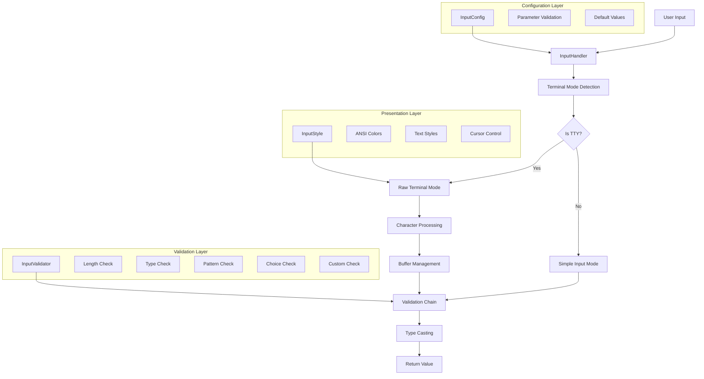

# Architecture Documentation

## System Overview

The `robust_input` library is designed as a modular, high-performance terminal input system with clean separation of concerns and professional-grade reliability.

## Design Principles

### 1. Single Responsibility Principle
Each class has one clear purpose:
- `InputStyle`: ANSI styling and color management
- `InputValidator`: Input validation logic
- `InputConfig`: Configuration management and validation
- `InputHandler`: Terminal interaction and orchestration

### 2. Configuration Object Pattern
All input parameters are encapsulated in `InputConfig`, providing:
- Centralized parameter validation
- Type safety
- Default value management
- Consistent API surface

### 3. Strategy Pattern
Multiple validation strategies are applied through `InputValidator`:
- Length constraints
- Type validation
- Pattern matching
- Choice validation
- Custom validators

### 4. Template Method Pattern
`InputHandler` provides the common input processing flow while allowing customization through configuration.

## System Architecture



## Class Design

### InputHandler

**Purpose**: Central orchestrator for input processing

**Key Responsibilities:**
- Terminal mode management
- Character-by-character input processing
- Buffer management with cursor positioning
- Validation orchestration
- Error display and recovery

**State Management:**
```python
class InputHandler:
    def __init__(self, config: InputConfig):
        self.config = config
        self.buffer = []              # Character buffer
        self.cursor_pos = 0          # Current cursor position
        self.old_settings = None     # Terminal state backup
        self._validators = []        # Pre-compiled validation chain
```

**Input Processing Flow:**
1. Terminal capability detection
2. Raw mode initialization (if supported)
3. Character reading loop
4. Input validation
5. Terminal state restoration

### InputValidator

**Purpose**: Provides validation strategies with performance optimization

**Design Features:**
- All static methods for stateless validation
- Regex pattern caching for performance
- Consistent return types (boolean)
- Comprehensive type support

**Validation Chain:**
```python
def _validate_input(self, input_str: str) -> bool:
    for validator_spec in self._validators:
        validator_type = validator_spec[0]
        
        if validator_type == 'length':
            if not InputValidator.validate_length(...):
                return False
        # ... additional validators
    
    return True
```

### InputConfig

**Purpose**: Configuration container with parameter validation

**Validation Architecture:**
- Constructor-time parameter validation
- Type checking for all parameters
- Consistency validation (e.g., min_length ≤ max_length)
- Regex pattern compilation testing

**Style Management:**
```python
def __init__(self, ...):
    # Set default styles
    self.prompt_style = prompt_style or [InputStyle.GREEN]
    self.input_style = input_style or [InputStyle.CYAN]
    self.error_style = error_style or [InputStyle.RED]
    
    # Validate after styles are set
    self._validate_config()
    
    # Generate styled prompt
    self.styled_prompt = self._build_styled_prompt()
```

### InputStyle

**Purpose**: ANSI escape sequence management and styling utilities

**Features:**
- Comprehensive ANSI constant definitions
- 256-color and RGB color support
- Style application utilities
- Performance-optimized string building

## Terminal Control Architecture

### Dual-Mode Design

The library operates in two modes based on environment detection:

#### Terminal Mode (Full Features)
- Raw terminal mode using `termios` and `tty`
- Character-by-character input processing
- ANSI escape sequence support
- Advanced cursor management
- Real-time validation feedback

#### Non-Terminal Mode (Fallback)
- Standard `input()` function usage
- Compatible with scripts, pipes, IDEs
- Graceful feature degradation
- Password support via `getpass`

### Terminal State Management

```python
def get_input(self) -> Any:
    if not sys.stdin.isatty():
        return self._simple_input()
    
    self.old_settings = termios.tcgetattr(sys.stdin)
    try:
        # Raw mode processing
        return self._terminal_input()
    finally:
        if self.old_settings:
            termios.tcsetattr(sys.stdin, termios.TCSADRAIN, self.old_settings)
```

### Character Processing Pipeline

```
Raw Character → Escape Sequence Detection → Command Processing → Buffer Update → Display Update
```

**Character Categories:**
- **Printable ASCII** (32-126): Add to buffer
- **Control Characters**: Special processing (Ctrl+C, Enter, Backspace)
- **Escape Sequences**: Navigation and extended keys

## Performance Architecture

### 1. Regex Pattern Caching

```python
class InputValidator:
    _pattern_cache = {}  # Class-level cache
    
    @staticmethod
    def validate_pattern(value: str, pattern: str) -> bool:
        if pattern not in InputValidator._pattern_cache:
            InputValidator._pattern_cache[pattern] = re.compile(pattern)
        return bool(InputValidator._pattern_cache[pattern].match(value))
```

**Benefits:**
- O(1) pattern lookup after first compilation
- Shared cache across all instances
- Memory efficient for repeated patterns

### 2. Pre-compiled Validation Chains

Instead of creating lambdas for each validation:

```python
def _build_validator_chain(self):
    """Build optimized validation chain without lambda overhead."""
    validators = []
    
    if self.config.min_length is not None or self.config.max_length is not None:
        validators.append(('length', self.config.min_length, self.config.max_length))
    
    validators.append(('type', self.config.target_type))
    # ... more validators
    
    return validators
```

**Benefits:**
- No lambda creation overhead
- Predictable validation order
- Easy to debug and profile

### 3. Optimized Buffer Operations

**Buffer Management:**
```python
class InputHandler:
    def __init__(self, config):
        self.buffer = []        # List for O(1) insertions
        self.cursor_pos = 0     # Current position tracking
```

**Character Insertion:**
- O(1) for append operations (common case)
- O(n) for middle insertions (less common)
- Optimized redraw algorithms

### 4. Efficient Display Updates

**Redraw Strategies:**
1. **Append Mode**: Direct character display
2. **Insert Mode**: Minimal redraw from cursor position
3. **Style Optimization**: Batch ANSI codes, skip styling for passwords

```python
def _redraw_from_cursor_optimized(self):
    remaining_count = len(self.buffer) - self.cursor_pos
    if remaining_count <= 0:
        return
    
    sys.stdout.write("\\033[K")  # Clear from cursor
    
    if self.config.is_password:
        sys.stdout.write("*" * remaining_count)  # No styling overhead
    else:
        # Optimized styling application
        ...
```

## Error Handling Architecture

### Graceful Degradation Strategy

```python
def get_input(self) -> Any:
    try:
        if not sys.stdin.isatty():
            return self._simple_input()
        return self._terminal_input()
    except (OSError, IOError):
        # Fall back to simple input on terminal errors
        return self._simple_input()
```

### Validation Error Management

**Error Flow:**
1. Input validation fails
2. Error message displayed below input
3. Input line cleared and cursor repositioned
4. User prompted to retry

**Screen Management:**
```python
def _display_error_and_reset(self):
    # Move to next line and display error
    sys.stdout.write("\\n\\033[K")
    sys.stdout.write(styled_error_message)
    
    # Return to input line and clear
    sys.stdout.write("\\033[A\\r\\033[K")
    
    # Redisplay prompt
    sys.stdout.write(self.config.styled_prompt)
    
    # Reset buffer state
    self.buffer = []
    self.cursor_pos = 0
```

## Security Architecture

### Input Sanitization

**Validation Layers:**
1. **Length Bounds**: Prevent buffer overflow attacks
2. **Type Validation**: Ensure data type consistency
3. **Pattern Matching**: Enforce format constraints
4. **Choice Validation**: Restrict to allowed values
5. **Custom Validation**: Application-specific rules

### Password Security

**Secure Input Handling:**
- No plaintext storage in buffers
- Immediate masking with asterisks
- Secure memory handling
- Proper cleanup on interruption

**Implementation:**
```python
def _display_char(self, char: str):
    if self.config.is_password:
        sys.stdout.write("*")  # Always mask
    else:
        sys.stdout.write(InputStyle.apply_style(char, *self.config.input_style))
```

### Terminal State Protection

**Resource Management:**
- Guaranteed terminal state restoration via `finally` blocks
- Timeout protection against hanging operations
- Safe character reading with error handling

## Extensibility Architecture

### Plugin Points

**1. Custom Validators:**
```python
def custom_validator(value: str) -> bool:
    # Custom validation logic
    return validation_result

config = InputConfig(
    prompt="Enter value",
    custom_validator=custom_validator
)
```

**2. New Input Types:**
```python
def get_custom_type(prompt: str, **kwargs) -> CustomType:
    return get_input(
        prompt=prompt,
        target_type=CustomType,
        custom_validator=CustomType.validate,
        **kwargs
    )
```

**3. Style Extensions:**
```python
class CustomStyle(InputStyle):
    CUSTOM_COLOR = "\\033[38;5;214m"  # Orange
    
    @staticmethod
    def gradient_text(text: str) -> str:
        # Custom styling implementation
        pass
```

### API Compatibility

**Backward Compatibility Strategy:**
- Additive API changes only
- Default parameter values for new features
- Deprecation warnings for removed features
- Version-specific behavior flags

## Testing Architecture

### Test Strategy Layers

**1. Unit Tests**: Individual component testing
**2. Integration Tests**: Component interaction testing
**3. Mock Tests**: External dependency isolation
**4. Property Tests**: Input space exploration

### Mock Strategy

**Terminal Operation Mocking:**
```python
@patch('robust_input.sys.stdin.isatty', return_value=False)
@patch('builtins.input', return_value='test_value')
def test_non_terminal_mode(self, mock_input, mock_isatty):
    # Test logic here
```

**Benefits:**
- Deterministic test execution
- Platform-independent testing
- Fast test execution
- Coverage of error conditions

## Deployment Architecture

### Distribution Strategy

**Single-File Module:**
- `robust_input.py` contains complete implementation
- No external dependencies beyond Python stdlib
- Easy integration into existing projects

**Package Structure:**
```
robust_input/
├── robust_input.py     # Core implementation
├── __init__.py         # Package interface
└── py.typed           # Type hint marker
```

### Cross-Platform Considerations

**Platform Support Matrix:**
- **Linux/Unix**: Full terminal features
- **macOS**: Full terminal features  
- **Windows**: Limited terminal features, full fallback support
- **IDEs/Scripts**: Automatic fallback mode

**Feature Availability:**
```python
if sys.stdin.isatty() and hasattr(termios, 'tcgetattr'):
    # Full terminal features available
    return terminal_mode_input()
else:
    # Graceful fallback
    return simple_mode_input()
```

This architecture ensures robust operation across diverse deployment environments while maintaining consistent API behavior.